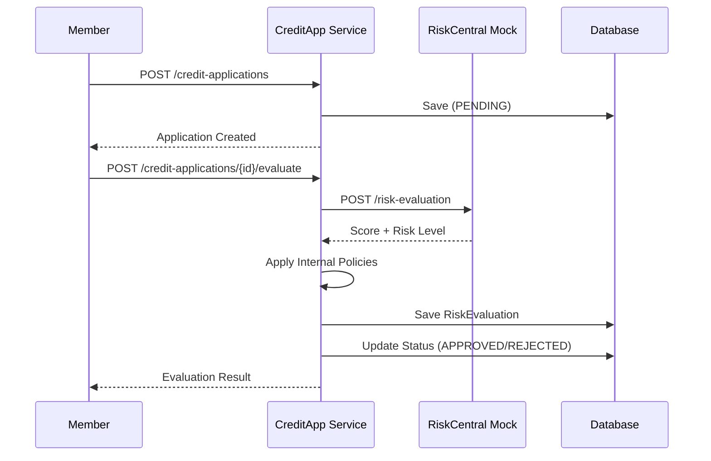

# 🏦 CoopCredit - Sistema Integral de Solicitudes de Crédito

Sistema profesional de gestión de créditos construido con arquitectura hexagonal, microservicios y Spring Boot.

## 📋 Descripción del Sistema

CoopCredit es una cooperativa de ahorro y crédito que necesita un sistema modular, seguro y escalable para gestionar el proceso de solicitud y evaluación de créditos.

### Microservicios

| Servicio | Puerto | Descripción |
|----------|--------|-------------|
| credit-application-service | 8080 | Servicio central de solicitudes de crédito |
| risk-central-mock-service | 8081 | Servicio simulado de evaluación de riesgo |

## 🏗️ Arquitectura Hexagonal

```
┌─────────────────────────────────────────────────────────────────┐
│                         INFRASTRUCTURE                          │
│  ┌──────────────┐  ┌──────────────┐  ┌──────────────────────┐  │
│  │   REST API   │  │   Security   │  │   JPA Repositories   │  │
│  │  Controllers │  │  JWT Filter  │  │      Adapters        │  │
│  └──────┬───────┘  └──────────────┘  └──────────┬───────────┘  │
│         │                                        │              │
│  ┌──────▼────────────────────────────────────────▼───────────┐  │
│  │                    APPLICATION LAYER                       │  │
│  │  ┌────────────────┐  ┌─────────────────────────────────┐  │  │
│  │  │   Use Cases    │  │       Services / Ports          │  │  │
│  │  │ - CreateMember │  │ - MemberRepositoryPort          │  │  │
│  │  │ - EvaluateApp  │  │ - CreditApplicationPort         │  │  │
│  │  │ - Authenticate │  │ - RiskCentralPort               │  │  │
│  │  └────────────────┘  └─────────────────────────────────┘  │  │
│  └────────────────────────────────────────────────────────────┘  │
│         │                                                        │
│  ┌──────▼────────────────────────────────────────────────────┐  │
│  │                      DOMAIN LAYER                          │  │
│  │  ┌─────────────┐  ┌──────────────────┐  ┌──────────────┐  │  │
│  │  │   Member    │  │ CreditApplication │  │RiskEvaluation│  │  │
│  │  │   Entity    │  │      Entity       │  │    Entity    │  │  │
│  │  └─────────────┘  └──────────────────┘  └──────────────┘  │  │
│  └────────────────────────────────────────────────────────────┘  │
└─────────────────────────────────────────────────────────────────┘
```

## 🔐 Roles y Permisos

| Rol | Permisos |
|-----|----------|
| ROLE_MEMBER | Ver sus propias solicitudes |
| ROLE_ANALYST | Ver solicitudes PENDIENTES, evaluar |
| ROLE_ADMIN | Acceso completo |

## 📡 Endpoints API

### Autenticación (Públicos)
```
POST /api/auth/register  - Registrar usuario
POST /api/auth/login     - Login (retorna JWT)
```

### Members (Requiere JWT)
```
POST   /api/members              - Crear afiliado
GET    /api/members/{id}         - Obtener por ID
GET    /api/members/document/{d} - Obtener por documento
PUT    /api/members/{id}         - Actualizar
```

### Solicitudes de Crédito (Requiere JWT)
```
POST /api/credit-applications           - Crear solicitud
GET  /api/credit-applications/{id}      - Obtener por ID
POST /api/credit-applications/{id}/evaluate - Evaluar solicitud
```

### Risk Central Mock (Sin autenticación)
```
POST /api/risk/evaluate - Evaluar riesgo crediticio
```

## 🚀 Ejecución Local

### Prerrequisitos
- Java 21
- Maven 3.8+
- Docker & Docker Compose

### Opción 1: Con script
```bash
cd coopcredit-system
./start.sh
```

### Opción 2: Manual
```bash
# Iniciar infraestructura
docker-compose up -d mysql prometheus grafana

# Iniciar Risk Central Mock
cd risk-central-mock-service
mvn spring-boot:run &

# Iniciar Credit Application Service
cd ../credit-application-service
mvn spring-boot:run
```

### Opción 3: Docker Compose completo
```bash
docker-compose up --build
```

## 🔗 URLs de Acceso

| Servicio | URL |
|----------|-----|
| Swagger UI (Credit) | http://localhost:8080/swagger-ui.html |
| Swagger UI (Risk) | http://localhost:8081/swagger-ui.html |
| Grafana | http://localhost:3000 (admin/admin) |
| Prometheus | http://localhost:9091 |

## 📊 Flujo de Solicitud de Crédito



## 🧪 Pruebas

### Ejecutar tests unitarios
```bash
cd credit-application-service
mvn test -DskipITs
```

### Ejecutar tests de integración (Testcontainers)
```bash
mvn verify
```

## 📈 Observabilidad

### Endpoints Actuator
- `/actuator/health` - Estado del servicio
- `/actuator/info` - Información de la app
- `/actuator/metrics` - Métricas JVM y HTTP
- `/actuator/prometheus` - Métricas para Prometheus

### Dashboards Grafana
1. **Coopcredit System Monitor** - Métricas HTTP, JVM, Circuit Breaker
2. **Coopcredit Database Records** - Registros de BD (Members, Applications, Evaluations)

## 🗂️ Estructura del Proyecto

```
coopcredit-system/
├── credit-application-service/
│   ├── src/main/java/com/coopcredit/
│   │   ├── domain/           # Entidades y puertos
│   │   ├── application/      # Casos de uso
│   │   └── infrastructure/   # Adaptadores (REST, JPA)
│   ├── src/main/resources/
│   │   └── db/migration/     # Flyway (V1-V6)
│   └── Dockerfile
├── risk-central-mock-service/
│   ├── src/main/java/
│   └── Dockerfile
├── grafana_provisioning/
├── docker-compose.yml
├── prometheus.yml
└── docs/diagrams/
```

## 📐 Diagramas

Ver carpeta `docs/diagrams/`:
- `architecture.puml` - Arquitectura hexagonal
- `microservices.puml` - Relación entre microservicios
- `use-cases.puml` - Casos de uso

## 🔒 Seguridad

- **JWT** stateless para autenticación
- **BCrypt** para encriptación de contraseñas
- **CORS** configurado
- Endpoints protegidos por rol

## 📦 Tecnologías

- Java 21 + Spring Boot 3.x
- Spring Security + JWT
- Spring Data JPA + Hibernate
- MySQL 8
- Flyway (Migraciones)
- MapStruct (Mappers)
- Resilience4j (Circuit Breaker)
- Micrometer + Prometheus + Grafana
- Testcontainers
- Docker + Docker Compose
- Swagger/OpenAPI

## 👤 Autor

Desarrollado como prueba de desempeño - Módulo 6: Java + Spring Boot
